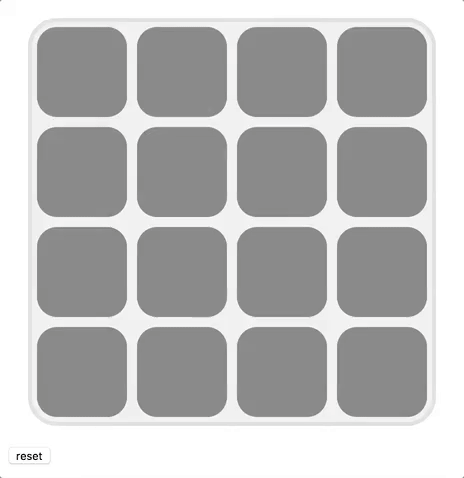

JavaScript is a great programming language to learn, games are fun and a good way to learn
programming concepts, why not make a game in JavaScript?

Applications that run in the browsers are highly accessible, if you wanted to get maximum 
visibility for your work building something that runs in the browser is a good choice. 

This is a vanilla JavaScript tutorial/challenge. It uses no extra libraries.
The tutorial creates a simple matching game to give purpose and provide problems to solve.

The tutorial covers many of the basic features of JavaScript: 

- Arrays
- Classes
- the DOM

# Premise

This tutorial will work with vanilla JS, it will not use any external libraries or 
frameworks. Everything will be accomplished with standard JS. This will give the project 
maxiumum compatibility. This approach allow you to focus on the core features of the JS language. 

# The Game

The game is called [concentration](https://en.wikipedia.org/wiki/Concentration_(game)). 

The game you will build is simple. It will provide an even number of grid squares, clicking or 
tapping a grid square will reveal a color, revealing second grid square with a matching color
will leave both colors visible, if the colors don't match they conceal themselves again. 

# Requirements

In order to put it all together you'll to need to have a basic understand of HTML, CSS, and JS. 

# How to use this tutorial

Each section begins with a short description of what needs to be accomplished. Followed by 
instructions on how I solved the problem. 

If you are new to JavaScript you can read the solution and implement it from what is presented
here. 

If you are already familiar with JavaScript think of the this tutorial as a series of 
challenges. Read the introduction to each section and try and solve the problem on your own. 
Compare your answer to the solution. 

If you feel pretty comfident in your ability with JavaScript think of this as an interview 
question. Stop here and create the game on your own from the description below. When you are
finished compare your work to the solution provided. 

# Mechanics

You'll use JavaScript to provide the logic for the game and control interactions. 

You'll CSS to provide the appearance, including the animation. 

You'll use HTML to define the structure. 

# Getting started 

This project will be created as a single HTML. All of the code that makes up the game will go into 
this file. While it's good practice to break HTML, CSS, JS into separate files, I'm going to 
leave that process to a refactoring step that will be applied afte the game is created. This game 
will be simple enough to contain it all in a single file, and having all of the code one place 
will make editing easy, and make it easier to see how the HTML, CSS, and JS interact and work 
together. 

# Editor

I used [Brackets](http://brackets.io) to create the example project and write these notes. I 
tested using the preview mode built into Brackets. Any text editor will work 
[Atom](https://atom.io) and [Sublime](https://www.sublimetext.com) are also good choices. 
You can also test in any browser you prefer. 
