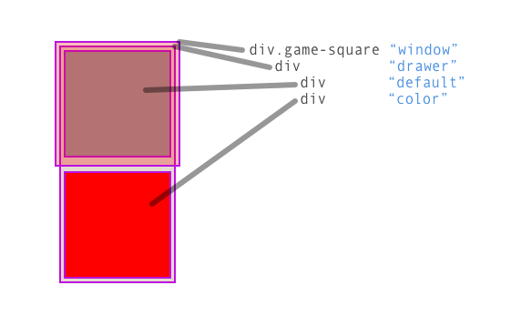
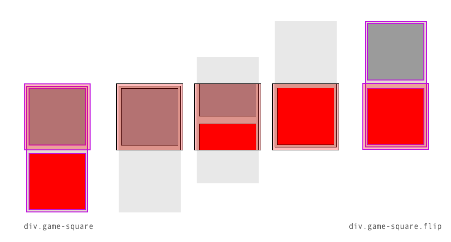

Getting started, the first step will be to create a new file and set up the HTML structure. 

# Step 1 - index.html

Make a new text file and add the boilerplate HTML. 

```
<!doctype html>
<html>
  <head>
    <title>Game</title>
    <style>
      /* CSS here */
      
    </style>
  </head>
  <body>
    <!-- HTML here -->
     
    <script>
      // JS Code here
      
    </script>
  </body>
</html>
```

The tags represent HTML elements. You will be writing code in three different languages within 
this single document. Notice the comments, there are three different types of comments. 

I placed the style tag in the head of document. It can go anywhere but this is a good place and
makes it easy to find. 

I placed the script tag at the end of the body tag. It's **important** to place this after the HTML
that makes up your app. The document is loaded from top to bottom, and th browser executes code 
as it is loaded, as soon as the end tag is reached. If the JS code is loaded before the structural 
tags in the body the code will run, look for tags that have not been loaded yet, and not be able 
to find them. Placing the JS code last on the page ensures that rest of the page has loaded first
before running the JS code. 

# Step 2 - Basic HTML Structure 

The next step is to add the HTML structure. You'll create tags that represent HTML elements that 
define objects on the screen. You'll give tags id and class names to make them easy to access 
in the DOM. The DOM is the Document Object Model. HTML defines the structure of the DOM. 

```
<div class='container'>
  <div id='game'>
    <!-- Game Ssquares -->
    
  </div>
</div>
```

Here you defined two div's `.container` will act as wrapper, and `#game` will hold the game and 
all of the game objects. 

There will only be one game it is unqiue, for this reason we give it an id name. 

# Step 3 - Game Square

The game will need 16 game squares. All of the game squares will have the same behavior and share 
the same styles. For this reason it makes sense for all game squares to share a class name: 
`game-square`.

All 16 game squares will have the same HTML structure. The tutorial will walk through creating 
one square first. Then we'll copy that square 15 times. 

A game square will be square that we can click. It will contain two other squares, one will 
represent the default appearance of a square, and the other will display the color for that square. 
The colored square will be reveled when the square is clicked or tapped.

Add this inside `div#game`:

```
<div class='game-square'>
  <div>
    <div></div>
    <div></div>
  </div>
</div>
```

# Game Square mechanics

Before continuing let's talk about the Game Square. The game square needs to display two different 
colors. One square will be the "default" and the other will be the "color" we are matching when 
we play the game. 

For this example we will have the two squares ("default" and "color") slide up to reveal the 
matching color and slide down to hide it. To make this work the two color squares will be wrapped 
in a "drawer" div, which will be wrapped in a another div that will act as a "window". The 
"window" is needed to act as a mask revealing what is inside the area of the "window".

Here is a picture: 



The "drawer" will slide up and down via the magic of CSS. Normally the "drawer" will align it's top
edge with the top of the "window". When we add the "flip" class it will slide up revealing the 
"color" div. Remove the class and it will slide back down again. 

Here is a picture:



# Step 4 - game-square styles

The next step is to style the Game Square. Let's break these up and apply them in stages. 

**.game-square**

```
.game-square {
  box-sizing: border-box;
  border: 1px solid #000;
  width: 100px;
  height: 100px;
  position: relative;
  overflow: hidden;
}
```

This should draw a 100px by 100px box. This is the "window". It's important that this div
have `overflow: hidden` this makes this div act as a mask, any of it's descendants that 
fall outside the area of `.game-square` will not be visible! This is what will make this 
div act as a "window". 

**"Drawer"** .game-square > div

```
.game-square > div {
  width: 100%;
  height: 200%;
  position: absolute;
  top: 0;
}
```

While the "drawer" is not visible at this point inspecting it will show that it is twice the 
height of the "window". 

**"Default" & "color"** 

```
.game-square > div > div {
  height: 50%;
}
```

Both of these squares need to take up half the height of the "drawer". You won't be able to see 
this is the browser but inspecting the two inner div's will show that they are stacked up and 
each is the size of the window. 

**"Default" square gets a style**

```
.game-square > div > div:first-child {
  background-color: gray;
}
```

Now the "default" square has a color!

To get the square to slide up and reveal the color to match we need a style: 

```
.flip > div {
  top: -100%;
}
```

Remember the `div.game-square > div` is 200%, if we add this class the game square div it's 
child div (the "drawer") will slide up the height of the height of it's parent. 

# Step 5 - Create some matching styles

In this step you will define some styles that represent the color applied to the "color" 
squares. These will be assigned randomly in a later step but we will define them here. 
You'll use a class name for this. By using a class name you can later change the look 
of the matching squares, like assigning them a picture, without having to edit the code 
that runs the game. Taking this approach the appearance of the game will be separate from 
the logic that runs the game. 

Add the following styles. 

```
.square-0 {
  background-color: aqua;
}

.square-1 {
  background-color: bisque;
}

.square-2 {
  background-color: blue;
}

.square-3 {
  background-color: blueviolet;
}

.square-4 {
  background-color: brown;
}

.square-5 {
  background-color: cadetblue;
}

.square-6 {
  background-color: chartreuse;
}

.square-7 {
  background-color: chocolate;
}

.square-8 {
  background-color: coral;
}

.square-9 {
  background-color: cornflowerblue;
}
```

I used named colors for each of these. Later you can change these to any other type of 
color or add other styles. 

There are only 9 colors here, when we play the game the game will only need 8 colors since
there are 16 squares and every color will appear twice. 

# Step 6 - Create 15 more Game Squares

It's time to create all of the game squares. Copy the `div.game-square` and it's descendants 
and paste it 15 times. 

You should now see a column of gray squares. 

# Step 7 - Arrange the squares in a grid

To arrange the squares in a grid you'll use flex box. You'll need to set the width and height 
of `div#game` to fit a 4x4 grid of 100px by 100px game squares. 

```
#game {
  width: 400px;
  height: 400px;
  display: flex;
  flex-direction: row;
  flex-wrap: wrap;
  border: 1px solid red;
}
```

`display: flex` makes `div#game` a flex container. `flex-direction: row` makes the flex items 
flow across left to right. `flex-wrap: wrap` tells the flex items to wrap when they run out of 
space at the end of a row. 

# Step 8 - Add a button to reset the game

The reset button should be inside the `div.container` below `div#game`. 

```
<button id='reset-button'>reset</button>
```

You gave the button an `id` because we will need to connect it to a JavaScript function later. 

# Step 9 - Get references to DOM elements with JS

You'll need to reference some of the DOM elements with yout JavaScript. In the case of 
unique elements you can use the id name. In the case of the Game Squares you'll want an 
array of similar elements. 

Add the following at the top of the script tag:

```
var resetButton = document.getElementById("reset-button");
```

With the first line you made a reference to an element via it's id name. This will always 
return a single element, even if there is more than one element with the same id name. 

You need a list of class names for the "color" classes named "square-1" - "square-9". 

```
var colors = [];
for (var i = 0; i < 10; i++) {
  colors.push('square-' + i);
}
```

# Step 10 - Game Objects

The game will need to keep track of the element that represent each Game Square 
(a `div.game-square`), assign a "square-#" class to one of the nested div's in a Game Square, 
we also need to get click/taps on a Game Square when they occur, and keep track of the state 
of each Game Square. 

The state of a Game Square might be:

- open or closed: closed and we see the upper "default" div, or open and we see the lower
"color" div. 
- locked or unlocked: Locked will identify a square as having been matched. In this case we 
can ignore clicks/taps, and the square stays open. 

The best approach is to create an object that represents a Game Square and encapsulates it's 
behavior. 

```
function GameSquare(el, color) {
  this.el = el;
  this.isOpen = false;
  this.isLocked = false;
  this.el.addEventListener("click", this, false);
}
```

This function defines a "GameSquare" class object and it's properties. It takes in two 
parameters: `el`, and `color`.

- `el` : The reference to a DOM element. In our case a `div.game-square`.
- `color` : The color of a square. This will be the class name that represents the color
of the square i.e. "square-1" to "square-9".

We want the square to listen for click events. 

`this.el.addEventListener("click", this, false);`

This line adds an event listener that listens for "click" type events. 

# Step 12 - Adding methods to GameSquare

Our class needs some methods. These are functions that that we can all on that work with 
instances of `GameSquare`. 

Game Squares need to do the following: 

- Handle events when they occur. We are listening for events but we also need to define 
what happens when those events occur. 
- Reset Game Square. This will set the game square back to it's starting state. This will 
be helpful when want to start the game again. 
- Lock, when we find a match we will want to lock those game squares. 
- Set Color, this will be useful when we restart the game, we want to change the colors
and set a new color for each game square. 

**handleEvent**

``` 
GameSquare.prototype.handleEvent = function(e) {
  switch (e.type) {
    case "click":
      if (this.isOpen || this.isLocked) {
        return;
      }
      this.isOpen = true;
      this.el.classList.add('flip');
  }
}
```

This method is called when an event occurs. The method receives an event object `e`. This 
object has a `type` naming the event. We need to handle `'click'` type events. 

When a click occurs check to see if the square is already opened (`isOpen == true`) or (`||`)
if the square is locked (`isLocked == true`). In either of the cases we can ignore the click. 

Otherwise mark the square as open (`this.isOpen = true`), and add the 'flip' class to the 
element's class list. The last step is to add the 'flip' class to the `el` which is the 
game square reference owned by this instance. 

**reset**

```
GameSquare.prototype.reset = function() {
  this.isOpen = false;
  this.isLocked = false;
  this.el.classList.remove('flip');
}
```

The rest method needs to set is open to false, is locked to false, and remove the flip class. 

**lock**

```
GameSquare.prototype.lock = function() {
  this.isLocked = true;
  this.isOpen = true;
}
```

When two squares are matched we'll call lock() on each. To lock a square we need to set is open
to true and is locked to true. 

**setColor**

```
GameSquare.prototype.setColor = function(color) {
  this.el.children[0].children[1].classList.remove(this.color);
  this.color = color;
  this.el.children[0].children[1].classList.add(color);
}
```

When the game is reset the colors need to be shuffled, set color allows us assign a new color 
to each square. This requires that we remove the color class from the second nest div, and 
add the new color to that div. The code above uses `childred()` here is a break down of what 
is happening here. 

- `this.el` : Is the game square div. 
- `this.el.children[0]` : the game square's child, the "drawer" div. 
- `this.el.children[0].children[1]` : the second child of the drawer div, this should be the 
color square. 

Now that you have the `setColor()` method defined let's use it. You'll want to call this 
when you create a `GameSquare`. Add the following to the *end* of the `GameSquare` function. 

```
function GameSquare(el, color) {
  this.el = el;
  this.isOpen = false;
  this.isLocked = false;
  this.el.addEventListener("click", this, false);
  this.setColor(color); // <-- Set the color!
}
```

# Step 13 - Set up the Game

Time to set up the game. To do this you need to make an array of Game Squares. One for each 
`div.game-square`. 

Define an array to hold all the `GameSquare` objects. 

`var gameSquares = [];`

Then define a function to setup the 
game. This function needs to get a reference to all of the `div.game-square` elements in the 
DOM then for each of these make a new `GameSquare` and initialize each with a a DOM element, 
and a color. For now we'll use the same color for each. Later we will randoize the colors. 

```
function setupGame() {
  var array = document.getElementsByClassName("game-square");
  for (var i = 0; i < array.length; i++) {
    gameSquares.push(new GameSquare(array[i], colors[0]));
  }
}
```

Now call this function to initialize the game. 

`setupGame();`

You should now be able to click each square to reveal the color. 

There are still some problems. The color is the same for each square, and there isn't any
animation. 

# Step 14 - Add some motion 

The appearance should all be handled with CSS. In this case we just need to add a single 
property to say that changes made to elements that match a selector should happen over time. 

Find the style for the "drawer" div. This should be: `.game-square > div`, add a transition.  

```
.game-square > div {
  width: 100%;
  height: 200%;
  position: absolute;
  top: 0;
  transition: 400ms; /* <- Add transition */
}
```

Testing now you should see the colored square slide up at 400 milliseconds (ms). 

# Step 15 - Assign random colors

`Math.random()` returns a decimal number, we need to get random items from an array, this 
requires an integer. Add a helper function to do this. 

```
function random(n) {
  return Math.floor(Math.random() * n);
}
```

This function returns a number from `0` to `n - 1`. 

The game has 16 squares which will require 8 color pairs. In our CSS we defined 10 colors/styles
"square-0" to "square-0". You need to pickout 8 of these at random and make an array with two 
copies of each color.

```
function getSomeColors() {
  var colorscopy = colors.slice();
  var randomColors = [];
  for (var i = 0; i < 8; i++) {
    var index = random(colorscopy.length);
    randomColors.push(colorscopy.splice(index, 1)[0]);
  }
  return randomColors.concat(randomColors.slice());
}
```

This function returns an array of 16 of our color class names in 8 pairs. 

The first line makes a copy of the `colors` array, `Array.slice()` returns a copy when it has 
not params. This is important because modifying this array would make it difficult to play 
the game a second time. 

Then define a new empty array: `randomColors`.

Next loop 8 times. With each loop get a random `index` number from 0 to the length of 
`colorsCopy`. This is the index of the color we want from the copy of the colors. Using
`Array.splice()` we remove the item at that index and add to `randomArray` with `Array.push()`.

The last step is double the items in the `randomArray` with `Array.slice()` to make a copy, and 
`Array.concat()` to append the new array on the end. Then return this array.

Now that we can get some random colors lets revisit `setupGame()`. 

```
function setupGame() {
  var array = document.getElementsByClassName("game-square");
  var randomColors = getSomeColors();             // Get an array of 8 random color pairs
  for (var i = 0; i < array.length; i++) {  
    var index = random(randomColors.length);      // Get a random index
    var color = randomColors.splice(index, 1)[0]; // Get the color at that index
    // Use that color to initialize the GameSquare
    gameSquares.push(new GameSquare(array[i], color));
  }
}
```

Three changes, get an array of 8 random color pairs. 

Find a random `index` for an item in the `randomColors` array. 

Get the color at that index, and *remove* it from the array. Using 
`Array.splice(index, deleteCount)` in this way deletes the items begining at index. It returns 
an array! We need the item not an array so we get the first item with `[0]`.

Last use that color to initialize a new Game Square. 

Test your work now, and as you click on each game square the colors be random. 

# Step 16 - Game logic

When you click on a square the game needs to ask: 

Is this the first square you clicked on? if so save this square. 

If this is not this is the second square you clicked on compare the colors of the first and 
the second squares clicked. Do they match? If so, lock them both, if not close them both. 

First add a var to keep track of the first square you click.

`var firstSquare = null;`

This can be `null` when begin when no square has been clicked. 

Add function to do this. 

```
function checkGame(gameSquare) {
  if (firstSquare === null) {
    firstSquare = gameSquare;
    return
  }

  if (firstSquare.color === gameSquare.color) {
    firstSquare.lock();
    gameSquare.lock();
  } else {
    var a = firstSquare;
    var b = gameSquare;
    setTimeout(function() {
      a.reset();
      b.reset();
      firstSquare = null;
    }, 400);
  }
  firstSquare = null;
}
```

This function takes a `GameSquare` as a parameter. 

The first step is to check if this is the first square clicked. If `firstSquare` is `null` it 
is, in that case set `firstSquare` to `gameSquare`.

If `firstSquare` is not `null` we need to ask if the `color` of `firstSquare` and `gameSquare`
match, if so call `GameSquare.lock()` on both. If they don't match they both need to be closed. 
This is tricky because this will happen before the animation that reveals the color has 
started! To close the square we can call `GameSquare.reset()` but this needs to happen after
a short delay. 

Using `setTimeout()` we can execute a function after a short delay but, there is a problem, 
the references to `firstSquare` and `gameSquare` will be lost. To preseve these they need to 
be assigned to a vars that are scoped to this function. 

Now that you have the `checkGame()` function defined we need to call it and pass when click 
a game Square and pass that game square in so check game can do it's magic. 

Modify `GameSquare.prototype.handleEvent`:

```
GameSquare.prototype.handleEvent = function(e) {
  switch (e.type) {
    case "click":
      if (this.isOpen || this.isLocked) {
        return;
      }
      this.isOpen = true;
      this.el.classList.add('flip');
      checkGame(this); // <- check the game here!
  }
}
```

The game should be working! You should be able to click squares have them open, they close
again if they do not match, or stay open if they do. Clicking matched squares should have no
affect. 

# Step 17 - Reset 

The last step is to handle resetting the game. After you've played once and matched all 
squares you'll want to play again. 

There are two steps involved close all of the game squares, then assigning a new color to each. 
If the closing step allows the squares to animate closed, setting the new color will have 
to wait until the squares are closed. 

Add a function to assign new colors. 

```
function randomizeColors() {
  var randomColors = getSomeColors();
  gameSquares.forEach(function(gameSquare) {
    var color = randomColors.splice(random(randomColors.length), 1)[0];
    gameSquare.setColor(color);
  });
}
```

This is similar to our set up function. Get some random colors, then loop through all of the 
game squares, for each game pull a random color out of the random colors and set the color 
of the game square. 

Add a function to clear the game. 

```
function clearGame() {
  gameSquares.forEach(function(gameSquare) {
    gameSquare.reset();
  });
  setTimeout(function() {
    randomizeColors();
  }, 500);
}
```

The for each loop defines a function that takes in each Game Square in the array and calls 
`reset()` on it. This should cause all of the squares to close. 

The last step here is to set a timeout that will call `randomizeColors()`. The timeout is 
required to give the square a chance to close. 

# Conclusion 

This a simple game created completely with vanilla JavaScript. It uses a variety of JS tools
and techniques. 

- Selecting DOM elements with JS
  - Selecting elements by id name
  - Selecting elements by class name
  - Selecting child elements of another element
  - Adding and remove class names from DOM elements
  - Adding click events to an element
  - Adding an event listener and listening for events of a type
- Working with Arrays
  - Getting the length of an array
  - Loop through all elements in an array with `for` and `forEach` loop
  - Using `slice()` to copy an array
  - Using `splice()` to remove items from an array
- Working with random numbers
- Creating classes with JavaScript
  - Creating class objects using the function syntax
  - Adding methods to a class object with the prototype chain

# Challenges 

The game has some areas where it can be improved. 

- Over all the style is not very good. Improve the appearance of the game. 
  - Improve the style of the squares.
  - Work on the interface the reset button needs some help.
  - The square-n styles for the colors could include images.
- Improve the game play
  - Try adding a timer. Try and match all squares before time runs out. 
  - Add a move count. Every click on a square counts as one move. 
  - Add more matching elements. 
  - Add an option that adds a larger number of squares to match. 

  
  


